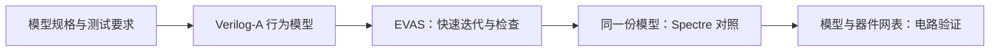

# vaEVAS

vaEVAS 是面向 Verilog-A 建模与评测的研究项目，包含 **benchmark** 和 **EVAS 电压域仿真器**。
benchmark 评估行为模型是否满足设计规格；EVAS 支持模型的快速开发与验证。

EVAS 的目标是提供**开源、可审查的仿真能力，在明确支持的电压域范围内优化速度**，
让经过验证的 Verilog-A 模型能够交给 Spectre 等电路仿真器，与器件级网表一起使用。
模型在 EVAS 中通过检查后，还需要验证后端兼容性，以及接入实际电路后的行为。

## Benchmark

benchmark 用于评估 Verilog-A 建模能力：给定模型规格，检查所编写的模型是否满足任务要求。
建设内容包括题目、运行环境、参考解和验收材料，采用 Harbor 任务格式。

**当前状态：**[benchmark/](benchmark/README.md) 包含六个 Harbor 格式的内部初筛任务，
覆盖逻辑、SAR 握手、时序、校准、VCO 和带负载运放。任务、环境与评分入口见模块说明；
[首轮结果](experiments/va_screen/RESULTS.md)记录模型提交、失败原因和验证边界。
[历史参考资料](benchmark/reference/README.md)包含 vaBench v1/v4 与原始模型来源。
这批任务作为基线保留，尚未作为正式 benchmark 发布；部分第三方资料仅限内部保存。
另有独立校准的[三角波振荡器修复候选题](benchmark/tasks/va07-triangle-repair/instruction.md)，用于检查事件方向与模型可移植性。

## EVAS 仿真器

EVAS 将优化集中在行为级电压关系上，服务于模型编写、调试和反复验证。
源码、数学原理、支持边界和测试依据在仓库中维护，便于审查和改进。
速度优化必须保持模型语义与误差要求；具体收益见[性能实验](experiments/performance/README.md)，
现有测量尚不能证明 EVAS 普遍快于 Spectre。

EVAS 将 Verilog-A 中的电压贡献转为方程，由 Rust 内核联立求解节点电压。
它面向以电压关系描述的行为模型，目前在限定范围内提供：

- **静态求解**：线性关系、多项式非线性反馈及稠密/稀疏矩阵求解。
- **瞬态与事件**：随时间推进输入和状态，处理 `cross`、固定 `timer`、采样与复位。
- **动态算子**：`transition`、`absdelay`、`slew`，以及受限的积分、微分和滤波关系。

输入由 `.va` 模型和 JSON manifest 组成；manifest 指定实例、节点连接和输入刺激。
当前不支持电流贡献和器件级电路网表求解，各算子的参数与组合限制见[能力表](evas/docs/CAPABILITIES.md)。

## 从行为建模到电路验证

项目的目标工作流是：



移交的核心是同一份 `.va` 模型、参数和接口约定。Spectre 负责模型与器件网表的共同求解，
进一步检查负载、反馈和初始化等电路行为。输出波形可以作为单向激励；
需要响应电路反馈时，应移交可重新求解的模型。

当前提供 EVAS 模型仿真、受限 Spectre 风格测试台读取和专项后端对照。
上述流程是集成方向，尚未形成通用的自动移交或双仿真器同步运行接口。
已测模型与差异见[实验记录](experiments/README.md)；
模型移交要求见 [EVAS 使用说明](evas/README.md#model-handoff)。

## 快速开始

需要 Python 3.10+ 和 Rust/Cargo。从源码构建并运行一个电压贡献求和示例：

```sh
git clone https://github.com/BucketSran/vaEVAS.git
cd vaEVAS
cargo build --locked --manifest-path evas/rust_core/Cargo.toml
PYTHONPATH=evas/src python3 -m evas solve evas/examples/01-static-gain/sim.json \
  --kernel evas/rust_core/target/debug/evas-kernel
```

[入门示例](evas/examples/README.md)按三课组织：静态求解、瞬态积分与
阈值事件计数；[第 1 课](evas/examples/01-static-gain/README.md)的三输入求和将三条电压贡献相加。
命令输出 JSON，`solutions` 中的电压按 `nodes` 顺序排列；三组输入的 `out` 电压约为
`0.225 V`、`1.825 V` 和 `-0.325 V`。

更多非线性与瞬态示例见 [EVAS 使用说明](evas/README.md#构建与运行)。
benchmark 的校准、身份复核与运行步骤见[初筛说明](experiments/va_screen/README.md)。
运行需要 Harbor 和已配置的 Spectre 环境；身份复核无需商业仿真器。

## 验证与实验

[独立验证集](evas/validation/README.md)使用共同模型和判据检查仿真器行为，
开发回归另外覆盖解析答案、语义不变性、失败后重试及算子组合。
它们与 benchmark 建模任务的评测成绩分别报告。

[实验记录](experiments/README.md)提供当前 EVAS 的验证结果、Spectre 等后端的历史对照和复现入口。
各轮结果绑定实际源码、输入和检查器；有限测试的通过范围与剩余验证限制在对应记录中说明。
main 保留持续维护的工具与支撑公开结论的精简证据；已结束的审查和阶段报告从固定历史提交查阅。
具体资产去向见[实验索引](experiments/README.md#目录结构)，保留规则见[贡献指南](CONTRIBUTING.md#main-branch-contents)。

## 仓库导航

本仓库是 EVAS 与 benchmark 的共同开发入口。两条线各按可验收结果建立任务；
EVAS 从[能力表](evas/docs/CAPABILITIES.md)选择问题，benchmark 从[候选登记](benchmark/CANDIDATES.md)
和[题库入口](benchmark/README.md)继续。候选与设计稿不等于已发布任务。

共享电路仿真 harness 在独立仓库维护执行与结果回收，目标是接入当前 EVAS 和远端仿真器。
涉及两仓修改时，按[跨仓库协作](CONTRIBUTING.md#cross-repository-work)加载各自指引、约定归属并完成联调。
EVAS 算法与评分规则仍在本仓库维护；模拟电路课程和上一阶段论文按需作为外部材料查阅。

| 目录 | 内容 |
| --- | --- |
| [benchmark/](benchmark/README.md) | Harbor 格式的任务、参考解、评分程序与运行环境入口 |
| [evas/](evas/README.md) | 仿真器源码、示例与开发测试 |
| [evas/docs/](evas/docs/README.md) | 数学原理、设计与支持边界 |
| [evas/validation/](evas/validation/README.md) | 独立测试模型、契约与检查器 |
| [experiments/](experiments/README.md) | 实验协议、执行收据与整理结果 |

开发与文档维护方法见[贡献指南](CONTRIBUTING.md)。
