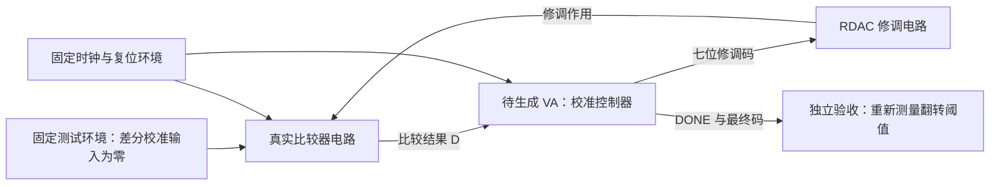

# Example：用 Verilog-A 完成真实比较器的失调校准

这是用于讨论任务定义的设计示例，写于 2026-10-04。**当前只有来源明确的 VA 资产；下文的外围电路、公开开发环境、参考解和 checker 尚未实现或验证。** 本文件不计入六道已运行的 Harbor 初筛题，也不表示这类任务已被证明足够困难。

## 为什么需要这段 VA

工程师有一个带七位 RDAC 修调接口的比较器，需要判断：校准以后，比较器的输入失调能否降到规定范围？

VA 控制器在仿真中读取比较结果、调整修调码并结束校准。比较器和 RDAC 的电路行为影响控制器的下一步操作，控制器的输出又改变电路工作状态。工程师可以先用这种控制模型验证校准方案，再决定后续实现。

本例用一个局部闭环完成上述工作，不要求恢复整颗 ADC。



## 来源与改编边界

原始资产是课题组的 [foreground_comparator_rdac_calibration.va](../reference/veriloga/lab/calibration_control/foreground_comparator_rdac_calibration.va)，历史别名为 `zhaoh/VA_calib_foreground_rdac.va`，工程位置见[总来源文档](../reference/veriloga/SOURCES.md#lab-calibration_control-foreground_comparator_rdac_calibration)。

源码已有的内容：读取比较结果 `D`，逐位更新七位输出 `DC`，提供校准输入，并在既定过程结束后撤销 `EN`。原模块没有独立复位端口。文件的工程目录来源不能证明下文测试条件就是原工程条件，也不能证明原代码在恢复后的电路中正确。

本例拟把校准输入、比较器时钟和模式切换交给固定外围环境；候选只生成控制器。新增 `RST`、`DONE` 和明确的时序合同，以便验收重启及完成状态。**这些是出题改编，原始 VA 文件保持不变。**

## 给模型的题面示例

> 从本节开始到“模型应交付什么”结束，可作为未来 `instruction.md` 的主体。这里描述的输入文件是待制作材料；实际文件和仿真命令就绪前不能发题。

你需要实现一个 Verilog-A 控制器，对给定比较器进行前台失调校准。比较器通过七位 RDAC 码调整输入翻转阈值。校准期间，测试环境将比较器差分输入设为零，控制器只能从比较结果和时钟获得反馈。

目标是在最多 20 次有效判决内结束校准，使最终输入失调绝对值不超过 `0.50 mV`。允许选择自己的搜索方法，不要求复刻特定源代码或中间码序列。

### 提供什么

| 材料 | 用途 |
| --- | --- |
| 比较器、RDAC 和外围连接网表 | 查看连接关系并运行公开实例；这些文件不属于提交内容 |
| 端口与时序说明 | 给出码序、电平、判决极性、复位与输出更新约定 |
| 公开开发实例 | 包含初始失调方向不同的实例，以及一次复位后重新校准的场景 |
| 编译与仿真入口 | 运行候选 VA，返回编译日志和公开实例波形 |
| 公开测量结果 | 检查开发实例的完成时间和最终失调；最终验收使用其他实例 |

公开实例和隐藏实例满足同一份环境合同。具体器件参数、失配样本和修调曲线可以不同。

### 控制器接口

```verilog
module calib_ctrl(CK, RST, D, DC, DONE);
    input CK, RST, D;
    output [6:0] DC;
    output DONE;
    electrical CK, RST, D, DONE;
    electrical [6:0] DC;
    parameter real vdd = 1.0;
    // 实现由候选模型完成。
endmodule
```

所有端口使用 `electrical` discipline，逻辑判别阈值为 `vdd/2`。输出低、高电平分别为 `0` 和 `vdd`，使用 `50 ps` 的有限上升、下降时间。`DC[6]` 为最高位。

`vdd` 的公开测试范围拟为 `0.9–1.1 V`；实际采用的电压及电路工作条件须先通过环境资格验证。逻辑稳态低、高分别须落在 `[0, 0.1*vdd]` 与 `[0.9*vdd, vdd]`，过渡期间另按规定的边沿时间检查。

### 电路保证什么

以下数值是本例的拟议设计参数，需要恢复电路后验证可达；它们不是从原工程测得的指标。

设 `V_os(k)` 是修调码为 `k` 时，比较器由低判决变为高判决所需的差分输入电压。

- `k` 为 `0–127` 的整数，增加 `k` 会单调降低 `V_os(k)`。
- 相邻码的阈值差满足 `0.20 mV <= V_os(k)-V_os(k+1) <= 0.40 mV`。
- 两个端码覆盖零点：`V_os(0) >= 8 mV`，`V_os(127) <= -8 mV`。
- 校准输入为零，所以 `D=1` 表示当前阈值为负，`D=0` 表示当前阈值为正。阈值恰为零时两种判决均可接受。
- 本例首版使用关闭随机噪声的确定性仿真。所有入选实例必须先验证在约定采样窗口内给出有效逻辑电平；未能满足该条件的电路不能直接加入这份合同下的测试集。
- 比较器复位、判决相位、校准输入和模式选择由固定外围环境控制。候选不需要自行产生这些信号。

公开的是可观测规律和工作范围，具体的 `V_os(k)` 表不作为候选输入。环境保证存在满足误差目标的码；候选需要通过实际反馈找到合格码。

### 时序、完成与重启

本例拟采用 `100 ns` 周期、50% 占空比的 `CK`。时序安排也需要在外围电路上验证后冻结。

1. 在初始化或 `RST` 为高时，控制器输出中间码 `64`，并将 `DONE` 置低；复位优先于校准。复位转换允许输出按规定边沿时间建立。
2. 测试环境保证复位高电平至少持续一个周期；释放复位后至少等待半个周期，再发起第一次比较。复位边沿与 `CK` 边沿至少相隔 `5 ns`，不考查未定义的同刻事件顺序。
3. 每个 `CK` 上升沿对应一次使用当前修调码的比较。固定外围环境保证 `D` 最迟在该上升沿后 `40 ns` 有效，且至少保持到随后的下降沿后 `1 ns`。
4. 控制器在 `CK` 下降沿读取一次判决。需要改变输出时，`DC`、`DONE` 的目标值只可在该下降沿后 `2–3 ns` 内更新，随后按规定的有限边沿建立。所有变化须在下降沿后 `3.1 ns` 前完成。
5. RDAC 对合法码变化的建立时间不超过 `20 ns`，因此上述安排为下一次比较留出建立时间。完成前允许保持当前码并继续取得新判决，不强制每周期更新。
6. 最迟在第 20 个有效判决下降沿后 `3.1 ns`，`DONE` 必须为高、最终码必须稳定。`DONE` 拉高以后，时钟继续运行时输出保持，直到下一次复位。
7. 运行中的复位必须中止旧校准；释放后开始新的校准，判决次数重新计数。测试环境也同步复位比较器时序。

正常更新窗口内可以有有限的电平码过渡；复位后的建立窗口同样允许过渡。其他时段输出必须保持合法逻辑电平。最终码按总线电平解码，不要求与某个参考搜索算法选择相同的码。

### 模型应交付什么

提交 `/work/dut.va`，实现上述唯一顶层模块。允许在自己的 VA 中定义辅助函数；最终提交不修改外围网表、测量程序或评分程序。

开发时允许查看公开电路、运行编译与仿真、读取波形并修改代码。最终候选 VA 仅通过声明端口获得反馈，不读取文件、隐藏配置或层级内部节点。

后续试验可先采用“每次独立尝试 20 分钟、最多 20 次公开仿真调用”的预算草案。**预算也尚未校准，不是已经执行的实验设置**；实际运行前需按参考流程耗时固定，并记录模型版本、实际调用和资源使用。

## Checker 设计：从真实电路的表现验收

本节是出题者设计说明。测试条件、容差和接口承诺必须在正式题面公开；具体隐藏实例、参考解和验收实现不提供给候选。

### 校准前先验证测试环境

对每个拟入选的电路实例，固定每个合法修调码，以独立电路扫描测量翻转阈值、判决极性和建立时间。确认单调性、覆盖范围、码间步长、有效逻辑窗口及可达误差均满足合同，再运行参考控制器。

实例集合和配置在模型测试前冻结。资格验证不通过的实例应作为电路或任务设计问题记录；不能在看到候选失败以后删掉实例、改变分母或放宽容差。

### 评分的三个层次

| 层次 | 检查内容 | 判定依据 |
| --- | --- | --- |
| 可执行性 | 编译、仿真完成，无非法访问或超时 | 固定 Spectre 环境的退出状态与日志 |
| 接口和过程 | 初始码、更新窗口、逻辑电平、完成时限、完成后保持、复位重启 | 候选端口波形和公开时序合同 |
| 校准效果 | 最终码接入比较器后，输入失调达标 | 独立扫描真实比较器的翻转阈值 |

效果测量时，checker 读取最终码，把该码接到一个使用**相同器件参数与失配实例**的独立表征网表中。此网表不实例化候选控制器，因而测量过程不依赖候选自行报告的结果，也不会被候选继续驱动的校准输入掩盖。

对每个固定码，独立从正、负两个方向建立输入扫描，在每个扫描点重新复位并触发比较器，得到翻转阈值区间 `[L,U]`。首版仅纳入经资格验证无显著迟滞、结果可重复的实例。

误差目标为 `E=0.50 mV`。判定规则拟为：

- 若 `[L,U]` 完全位于 `[-E,E]`，效果通过。
- 若区间与 `[-E,E]` 不相交，效果失败。
- 若区间跨越验收边界，继续细化扫描；达到预先规定的测量精度仍不能判定时，记录“测量不确定”，不伪装成候选功能失败或成功。

扫描精度及最大细化次数要先在实际电路上校准，并与题面一起冻结。测试结果分别记录任务失败、环境失败、测量不确定；汇总报告保留全部分母和原因。

候选必须在所有有效隐藏场景中同时通过过程和效果检查。可以报告分类诊断分，但最终任务通过率不以“编译成功”或若干通过采样点代替。

### 隐藏场景与错误版本

隐藏场景在公开合同内覆盖不同初始失调方向和幅度、非均匀但单调的修调曲线、不同合法判决延迟，以及中途复位和完成后再次校准。所采用的电压、温度和器件失配范围须由恢复后的电路证据支持并公开，不能另藏未承诺的工作范围。

出题者至少需要用以下错误版本检查 checker 是否能识别问题：固定输出中间码、读反比较器极性、使用上一次校准遗留状态、在规定判决窗口之前读取未完成的结果、提前宣布完成后继续改码。参考控制器必须通过同一套检查。

其中，提前读取结果的错误需要能产生实际错误判决的有效电路场景来验证；仅在源码里搜索某个写法不能代替行为验证。早读但偶然得到相同值的单个实例也不能证明 checker 无效，应结合完整冻结场景判断。

## 这个 example 考查什么，尚不能说明什么

它考查控制器能否正确使用电路反馈、遵守有效判决与建立窗口、结束校准并支持重启。接口、规律和验收标准明确，搜索算法由候选选择。

它仍可能被强模型轻松解决：无噪声、单调的七位搜索算法本身并不复杂。该题首先用来验证“真实电路闭环验收”是否可行，不能因为接入晶体管就宣称高难度。

如果初筛仍全部通过，应按真实工程需求寻找下一种能力缺口，例如已有控制器的集成故障诊断，或真实非理想条件下的校准。增加噪声、迟滞、码间非单调性会改变可解性与验收合同，必须另立题目并证明可达，不能直接加入隐藏测试。

## 其他可选方向

模型提取、故障修复、功能扩展、测量工具和仿真优化各有一份独立事例，见[任务事例目录](README.md)。规格到代码的初筛题保留为基线。这些能力目标不同，不能仅按文件长度或电路规模混成一个难度等级。

## 落地还需要的材料

目前已有原始校准 VA 与历史来源。仍需恢复或另行取得可使用的比较器、RDAC 网表和模型依赖，确认接法与原工程目标；如果改用新构建电路，必须明确标注来源和改编，不能称作原工程完整复现。

随后才能制作公开开发环境、独立测量程序和参考解，验证本例的数值及时序合同。若电路不能满足这些拟议参数，应在发题前调整设计，而不是修改原始资产来制造历史依据。

环境和 checker 校准完成后，才把可运行版本放入 `benchmark/tasks/<task-id>/`，按 [Harbor 任务约定](../README.md#任务结构)组织材料。本文保持为任务设计示例。
