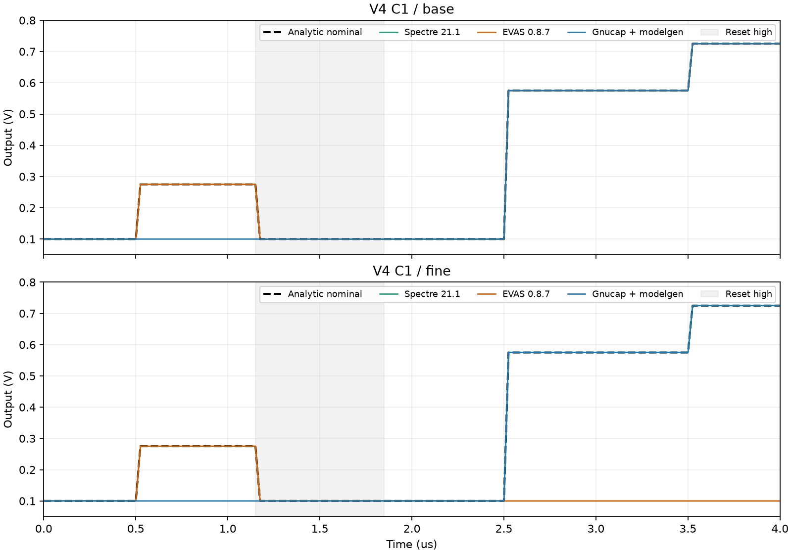
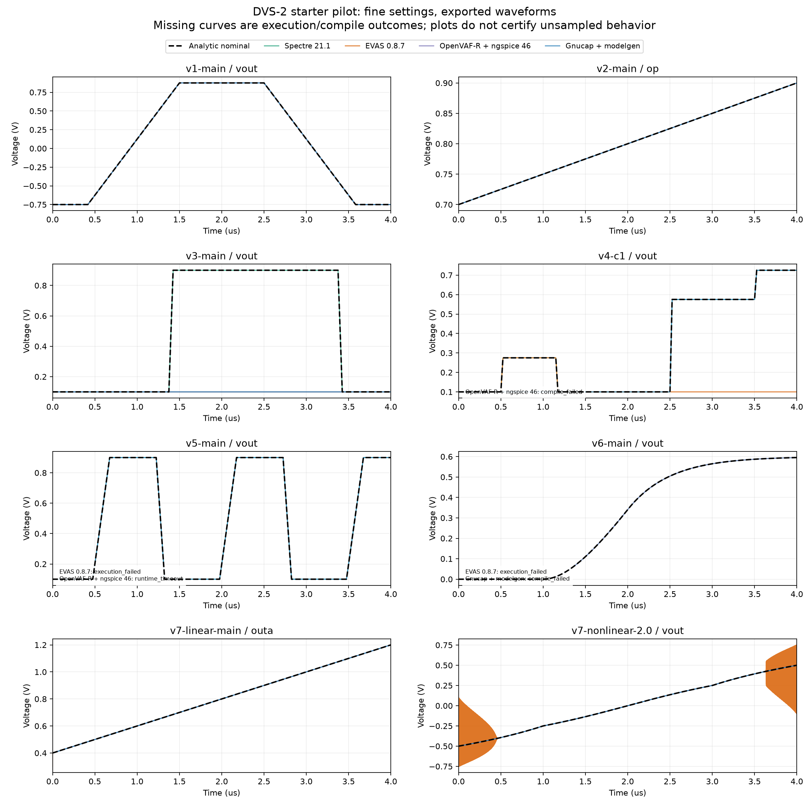

# 八张起步卡的四后端试点结果

2026-09-27，运行编号 `dvs2-starter-20260927-01`。**7 类、8 张卡已全部运行：展开为 15 个条件，四后端各执行基础/细化两档，共 120 条配置记录。** 结果来自同一获准 Linux amd64 服务器。没有修改任何仿真器，也没有用改写模型替换失败条件。

这是有限观测的功能试点。本文的“满足”表示导出波形通过当前分析器已实现的观测筛查；[运行前协议](README.md) 要求的完整时序资格尚未实现，**不等于完整 DVS-2 合规通过率**。正式观察资格均仍标记 `I`，论文 [Table 3](../../evas/validation/COMPARISON_TABLE.md) 的 p/N 暂不填入这些数字。

## 1. 总体结果

| 后端 | 基础档满足 / 15 | 细化档满足 / 15 | 未满足或未产生可判波形的记录：基础 → 细化 |
| --- | ---: | ---: | --- |
| Spectre 21.1 | 15 | 15 | 0 → 0 |
| EVAS 0.8.7 | 8 | 5 | 5 → 8 个观测反例；各 2 个执行失败 |
| OpenVAF-R＋ngspice 46 | 11 | 11 | 各 1 个观测反例、2 个编译失败、1 个超时 |
| Gnucap＋modelgen-verilog | 11 | 11 | 各 3 个观测反例、1 个编译失败 |

分母 15 指预先冻结的条件数，不是 15 个独立电路家族或总体成功概率。表中 OpenVAF 是实际安装的 **OpenVAF-R v24.0.2mob 分支**，不能将结果泛指所有 OpenVAF 版本。

下表每格按“基础 → 细化”列出满足观测的条件数；“错误”指已导出的波形违反本轮目标，其余为明确失败阶段。

| 卡 / 行为 | 条件数 | Spectre | EVAS 0.8.7 | OpenVAF-R＋ngspice | Gnucap＋modelgen |
| --- | ---: | --- | --- | --- | --- |
| V1 增益、失调、限幅 | 1 | 1 → 1 | 1 → 1 | 1 → 1 | 1 → 1 |
| V2 参考、差分、共模、供电 | 4 | 4 → 4 | 4 → 4 | 4 → 4 | 4 → 4 |
| V3 阈值与迟滞 | 1 | 1 → 1 | 1 → 0；细化错误 | 0 → 0；输出错误 | 0 → 0；输出错误 |
| V4 采样、保持与复位 C0/C1 | 2 | 2 → 2 | 2 → 0；细化错误 | 0 → 0；编译失败 | 0 → 0；首次采样缺失 |
| V5 timer、延迟与边沿 | 1 | 1 → 1 | 0 → 0；前端拒绝 | 0 → 0；运行超时 | 1 → 1 |
| V6 一阶低通 | 1 | 1 → 1 | 0 → 0；lowering 失败 | 1 → 1 | 0 → 0；modelgen 失败 |
| V7 线性隐式关系与实例隔离 | 3 | 3 → 3 | 0 → 0；输出错误 | 3 → 3 | 3 → 3 |
| V7 单调非线性隐式关系 | 2 | 2 → 2 | 0 → 0；输出错误 | 2 → 2 | 2 → 2 |

V2 的四个条件为主刺激及参考置零、供电固定、输入共模单独变化；V7 线性的三个条件为主刺激、交换实例声明顺序、仅将 A 输入减半。V7 非线性分别取 λ=0.5 和 2。条件与参考定义见 [suite.py](suite.py)，逐条结果见 [CSV](results/results.csv) / [JSON](results/results.json)。

## 2. 能直接复核的反例

**EVAS 的设置细化没有保证这些状态行为保持正确。** V3 在 t=3 µs、输入 0.5 V 时，迟滞历史要求输出仍为 0.9 V；基础档得到 0.9 V，细化档得到 0.1 V，最大观测误差 0.8 V。V4 C1 在 t=2.75 µs 应恢复采样并保持 0.575 V，基础档约为 0.575 V，细化档为 0.1 V；后续最大观测误差达 0.625 V。输入波形已逐点核对，不能用输入未到阈值解释这些结果。尚未进行代码级根因定位。

图中 Gnucap 的问题有所不同：两档都漏掉 t≈0.5 µs 的首次采样，应该保持 0.275 V 的区间仍为 0.1 V，名义最大误差 0.175 V；后续采样可以发生。因此本轮不能概括成“Gnucap 不支持时钟”或“所有复位都错误”。OpenVAF-R 的该卡没有波形，编译器拒绝 `cross(...) or cross(...)` 事件组合，图中没有人为补线。

**EVAS 的隐式关系有明确反例。** V7 线性主条件在 t=0 的 A/B 唯一解均为 0.4 V，EVAS 输出均为 0.3 V；随后接近正确曲线不消除初始化反例。V7 非线性 λ=0.5 两档最大观测误差为 0.0625 V；λ=2 的基础/细化档分别约为 0.5971/0.6006 V。参考由独立单调括区二分计算，并用闭式解和有理数锚点校验，未使用 Spectre 波形作为真值。

**前端和运行失败分开记录：**

- EVAS V5：固定 `--spectre-strict` 配置拒绝本卡三参数 `timer`，诊断为 `EVAS-COMP-EPARSE`、`Expected RPAREN, got COMMA`。没有删除第三个参数后改算通过。
- EVAS V6：lint 无诊断、VA 编译阶段完成，随后报 `rust_lowering ... no_event_transition_ir`。lowering 是把前端模型转换成运行引擎表示的阶段；本次没有产出波形。
- OpenVAF-R V3：孤立 `cross` 能编译并执行，但输出保持低电平，最大观测误差 0.8 V。该证据修正了“只要有 cross 就不能编译”的泛化说法。
- OpenVAF-R V4：编译器对 `or` 及其后的事件表达式报错。这里确认的是该版本对这一编码的拒绝，不推断所有事件结构都不支持。
- OpenVAF-R＋ngspice V5：OSDI 编译成功，两档都在 90 s 上限超时。日志经过 gmin/source stepping 失败后停留于 transient operating-point 启动过程；不将超时写成已证实的语言不支持。
- Gnucap V3：两档输出均保持 0.1 V，应为高电平的平台未出现。V6 在 modelgen 阶段退出，只有 `what's this?` 诊断；不能据此确认是整个 `laplace_nd` 功能不支持，还是当前内联系数数组等编码问题。

上图每卡选择一个条件，不能代替全部 120 条记录。V7 线性在 t=0 的短时反例不容易从全时域图看清，应结合数值记录；重合曲线也不代表内部算法相同。

## 3. 比较条件与设置证据

共同 S=1 V、T=1 µs、终点 4 µs；同一 DUT 在四后端使用相同字节，外部刺激均由同一条件对象生成 PWL。输出覆盖起止时间、列完整且有限、时间严格有序，实际输入逐点核对到 1e-7 V；已导出的波形均完成这些检查。最大允许观察间隔为 1 ns。

| 设置 | 基础档 | 细化档 |
| --- | --- | --- |
| 请求输出步长 / 最大步长 | 1 ns / 1 ns | 0.1 ns / 0.1 ns |
| 相对容差请求 | 1e-5 | 1e-6 |
| 电压绝对容差请求 | 1e-8 V | 1e-9 V |
| 电流绝对容差请求 | 1e-12 A | 1e-13 A |

- **Spectre**：逐次 PSF 头部确认上述参数实际值，`method=traponly`，`errpreset=moderate`；导出接受点，没有强制 strobe。可检查 [30 条实际设置](results/spectre-effective-settings.json)。
- **ngspice**：网表固定 `.options reltol/vntol/abstol method=trap` 和 transient 步长请求；启动日志显示 SPARSE 1.3 求解器。当前未另行保存这些数值选项的运行时回读，故只能将其列为已提交的请求，不能声称与 Spectre 的误差控制等价。
- **Gnucap**：预检 options 回读确认 reltol/vntol/abstol 接受对应值，默认 method 为 trap；各运行网表记录实际使用的步长命令。网表与导出语义仍不能凭名称与 Spectre 等同。
- **EVAS**：日志显示读取 step/reltol/vabstol，导出间隔实际发生变化；这不证明 reltol/abstol 已具备 SPICE 式误差控制。两档同时改变了设置，当前不能将状态异常单独归因于某一个参数。

电压判据沿用运行前目标：V1/V7 为 1 mV，V2 差模 2 mV、相对共模 1 mV，V6 为 0.6 mV。事件卡同时检查平台和可见边沿，并传播合同允许的事件定位偏移。**沿内相对“名义时刻”的电压差不能直接拿来排名。** 例如 Spectre V3 基础档名义最大差约 4 mV，来源于允许的事件时间偏移，整条观测仍满足本轮事件判据。V6 则可直接按解析连续响应比较：Spectre 两档的最大观测差约 3.52e-8 / 3.53e-10 V。

### 工具身份

| 链路 | 实际身份及边界 |
| --- | --- |
| Spectre | 21.1.0.509.isr12，固定安装；每次保存版本与 PSF 设置 |
| EVAS | CLI/package 0.8.7，evas-rust core 0.2.4，ABI 20260718；build_revision 未提供，不虚构源码提交 |
| OpenVAF-R | 固定 v24.0.2mob 发布包；CLI 自报 `OpenVAF-reloaded unknown`，故同时依赖包/镜像哈希定位 |
| ngspice | 固定容器中的 46；没有用服务器原生的其他版本替代 |
| Gnucap / modelgen | 固定 2026.07.29 环境快照；模型生成、C++ 编译、运行分阶段记录 |

完整公开镜像身份见 [TOOL_IDENTITIES.json](results/TOOL_IDENTITIES.json)。商业软件、镜像层、许可证配置不随 Git 分发；公共代码目前是依赖既有环境的执行/分析入口，并非可从零构建全部工具的发行包。

## 4. 执行与判定方法审查

实际启动 **114 次电路仿真**，另有 6 条配置因共享 DUT 编译失败而没有启动模拟器；120 条全部有记录。独立编译阶段为 OpenVAF 8 次、modelgen 8 次、C++ 7 次。同源码的编译结果在条件/设置之间复用。共获得 108 份波形，执行失败 4 条、编译失败 6 条、超时 2 条。没有因模型结果不好而重复运行。

按 Spectre → EVAS → OpenVAF-R＋ngspice → Gnucap 的顺序串行执行；单 CPU 亲和性，Spectre `+mt=1`，容器单线程环境，每阶段 90 s 上限，Spectre 许可证等待上限 30 s。两次超时均完成容器清理。过程中一次 SSH 连接异常退出，但服务端 Spectre 的全部完成凭据及结果仍完整，未重放该批。原始阶段耗时包含容器、编译或许可证等待等不同开销，**本轮不报告速度排名或 P95**。

[test_analysis.py](test_analysis.py) 的 10 个测试方法及其子案例，在本地和服务器均通过：覆盖 15 条正确合成轨迹、独立数值锚点、具体行为故障、合法事件偏移、阈值内外及坏观察输入。还检验相关输入下的共同错误可由 V2 单因素条件暴露，以及样点间隐藏脉冲无法被有限采样认证。两处执行是同一套 10 个方法，不能写成 20 个独立测试。

这提供了判定器的有限校准证据，**没有给出一般误收/误拒率**。相对运行前协议还有明确缺口：当前状态汇总对样点包络、平台和边沿缺失/多次穿越作筛查；输出边沿的联合括区与完整 tr/tf 估计只记录为诊断，未将括区分离和 1% 边沿指标单独作为合格门槛，也没有完成跨边沿共同历史的独立认证。因此不能称为全部预定性质通过。内部事件未被直接观察，样点之间的行为、观察干预、参考浮点误差的完整上界和更广的区别性错误仍未完成资格论证。所有配置的正式 DVS 资格保守地保持 `I`；原始编译/执行结果及明确观测反例仍分别保留。这不会把错误隐藏成“通过”。

## 5. 复核入口与证据

- [结果 CSV](results/results.csv)：120 条配置、执行/观测状态、样点数、观测间隔及误差摘要。
- [详细结果 JSON](results/results.json)：事件括区、平台、残差等分析及源码/网表/波形 SHA-256。
- [计数](results/counts.json)、[执行审计](results/execution-audit.json)、[归档收据](results/ARCHIVE_RECEIPT.json)：绑定冻结输入、实际启动次数及私有原始证据。
- [suite.py](suite.py)、[analyze.py](analyze.py)、[run_remote.py](run_remote.py)、[report.py](report.py)：生成、判定、执行与图表步骤。

冻结输入包 SHA-256：`80cdd1ecc15608f90ce437ced809b2292ef03bf2970fb53c226bb83d9ef48a54`。它包含执行时的八个 DUT、协议、运行器、参考和校准脚本；结果撰写只更新说明和后处理图表，没有更改这些运行输入。完整证据保留于获准服务器私有持久目录，并下载至本地 Git 忽略的 `runs/dvs2-starter-20260927-01/`，按归档及逐文件哈希校验。不会将原始运行路径、主机配置、日志或许可证信息提交到公开仓库。

## 6. 下一轮应解决什么

1. **先完善验证方法。** 补齐事件/导出不确定度、有效设置回读、短脉冲与共同历史控制，以及各组尚缺的行为义务；再决定哪些条件能进入论文正式分母。不能靠增加相似案例数量代替这些证据。
2. **从现有证据提取最小反例。** EVAS 先定位 V3/V4 设置变化、V7 初态/非线性关系、V5/V6 前端路径；其他开源链路分别定位事件组合、首次采样、工作点超时和滤波编码拒绝。必要时一次只改一个因素，原始条件始终保留。
3. **确认问题归属后再修 EVAS。** 新版本单独记录，并复测受影响条件；修复后的成绩不覆盖 0.8.7 基线。共同正确且满足正式精度的样本确定后，再做公平反馈延迟比较。

现有数据证明这批测试能揭示具体差异和反例，尚不能证明 EVAS 必须存在或优于其他方案。其后续价值应由修复后的覆盖、可控精度与执行成本共同支撑。
