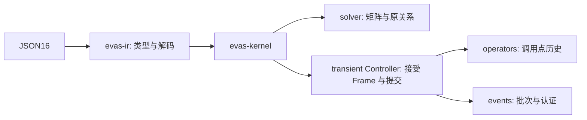

# 求解成本与内核边界

本目录测量静态求解、瞬态推进及构建成本。测量用于选择优化；不增加原 31 条件的分母，也不证明相对 Spectre 更快。

长期候选及优先级由 [issue #138](https://github.com/BucketSran/vaEVAS/issues/138) 维护。

<a id="direct-input-sharing"></a>

## 只读输入共享

`DirectInput` 将不可变点列和误差区间改为共享数组，减少候选与回放中的复制。
数值运算、认证、事件推进及历史验收保持原样。[本次收据](direct-input-sharing.json)
对应 main `040df8ed` 上的本地改动，尚未合入。

合成案例含 4097 个三角波拐点和 8193 个观察点，每个半段都有观察，覆盖非零积分值。
两批均交替运行基线与候选各五次，正式时间关闭诊断：

| 批次 | 基线端到端 ms，中位数及范围 | 候选端到端 ms，中位数及范围 |
| --- | ---: | ---: |
| 七案例批次中的长三角波 | 548.37，426.12–1063.25 | 225.64，212.68–312.37 |
| 长三角波单独复测 | 508.84，450.90–578.90 | 281.16，218.42–374.54 |

机器同时有其他任务，首批负载明显升高，所有慢样本均保留。第二批确认了本例收益，
但不据此承诺通用加速比例。另六例的时间范围重叠，没有测到稳定改善或退化。
峰值 RSS 也不足以支持通用节省内存的结论，减少复制不等于同比降低峰值内存。

诊断复测中，`history.clone` 中位耗时从 173.34 ms 降到 3.45 ms。
逻辑克隆仍为 24576 次，候选、求解和认证次数保持一致；共享的是输入数组。
该阶段未覆盖所有输入复制，阶段之间也有包含关系，不能相加或用它推算全部收益。

160 次配置执行全部完成。每例的新旧内核及诊断开关响应逐字节一致，包括误差区间和事件。
三角波另用精确有理数积分检查包含性，并按请求的原电压预算验收区间宽度。
校准反例确认，输出接近但区间漏掉答案时仍失败。229 项 Rust 和 157 项相关 Python 测试通过，
另有一项既有 Rust 测试保持忽略；覆盖候选隔离、回滚重试、复位、区间精度和拒绝。

两份已核验哈希的实际 Spectre 记录用于重跑同源码 LP-nd/LP-np 对照。
原 1 mV 有限观察标准保持，双方分别通过独立答案检查，每例 20 个严格同时间点的差异也达标。
这是既有滤波输入路径的有限对照，不证明一般波形精度，也没有测量相对 Spectre 的速度。

生成长输入请求时，在下面的瞬态基准命令前设置 `EVAS_BENCH_CASE=pwl_idt`
和 `EVAS_BENCH_OUTPUTS=8193`，小规模对照使用 129。该可选案例要求观察数为
`2*2^k+1` 且 `k>=2`；未设置案例时仍运行原五例。检查器校准命令为：

```sh
python3 -B -m unittest discover -s experiments/performance -p 'test_*.py' -v
```

## 固定矩阵复用与稀疏消元实测

[紧凑收据](results.json)保存配对结果、阶段、次数、内存和执行身份。相同请求与容差在基线/候选 release 内核上各运行五次独立进程，交替顺序。诊断开关及两个内核的输出逐字节相同，并通过基准内的独立答案。

| 请求 | 基线端到端 ms | 候选端到端 ms | 候选范围 ms | 分解次数（基线→候选） |
| --- | ---: | ---: | ---: | --- |
| random-1024 | 1671.45 | 329.14 | 328.13–330.52 | 1→1 |
| grid-256 | 17.69 | 17.37 | 15.40–62.92 | 1→1 |
| chain-1024 | 35.42 | 35.55 | 34.20–35.79 | 1→1 |
| idt-4097 | 66.66 | 63.84 | 62.80–64.32 | 16385→1 |
| nonlinear_idt-4097 | 110.51 | 105.36 | 104.74–109.19 | 16385→1 |
| timer-4097 | 23.50 | 22.58 | 20.54–24.71 | 33→1 |
| cross-4097 | 20.21 | 20.10 | 19.38–22.03 | 18→2 |
| pwl-131073 | 473.68 | 466.09 | 462.56–477.22 | 1→1 |

随机 1024 阶矩阵输入有 5,106 个非零项，LU 保存 149,102 项，消元填充更新是主要成本。本轮用一次 `BTreeMap::entry` 查找完成读改写，仅在新填充或精确抵消时更新活动列。主元、缩放、列次序和减法顺序保持不变。`sparse_ordering` 只计选择下一列，列度维护仍在 `sparse_elimination` 内。

积分候选与回放现在可共享接受帧的只读 LU。节点、驱动/未知量顺序、行数及全部系数的 binary64 位必须相同。每次仍计算当前 RHS、验收原关系与历史误差；非线性 Jacobian 不使用这个缓存。

阶段包含子阶段，不能相加。输出点、候选次数与积分器内部步数分开记录。矩阵行/列/nnz 和 LU 项数按分解累加，不是峰值。历史复制只统计调用次数与逻辑算子槽数，尚无分配/复制字节计数。短请求受进程启动和计时波动影响；诊断有额外成本。这些结果仅适用于固定合成工作负载。

## 重跑

先在收据指定的两个提交分别构建 release 内核。测量时不要同时构建或运行测试。从仓库根目录运行，输出目录必须不存在：

```sh
mkdir -p runs/performance/requests
EVAS_BENCH_SAMPLES=64 EVAS_BENCH_REQUESTS="$PWD/runs/performance/requests" cargo bench --locked --manifest-path evas/rust_core/Cargo.toml --bench static_solver
EVAS_BENCH_OUTPUTS=4097 EVAS_BENCH_REQUESTS="$PWD/runs/performance/requests" cargo bench --locked --manifest-path evas/rust_core/Cargo.toml --bench transient_solver
python3 -B experiments/performance/profile_requests.py --kernel /absolute/candidate/evas-kernel --baseline-kernel /absolute/baseline/evas-kernel --baseline-revision BASE_SHA --requests runs/performance/requests --out runs/performance/paired --repeats 5
python3 -B experiments/performance/measure_build.py --output runs/performance/build --repeats 2
```

20 个静态用例覆盖链、环、星、网格、固定种子网络、稠密与多项式。答案来自递推、构造的精确根或独立二分。五个瞬态用例检查斜坡、解析积分、`1/(1+t)` 及手算事件时刻。额外长斜坡由同一 PWL 请求将 `output_times` 改为 `[i/131072 for i in range(131073)]`。
库内静态基准另外用默认 512 个重复 RHS，瞬态用 129 与 4097 点各测五轮。不同点数的结果不相减作为传输成本。

完整边界为 Python 序列化 → 启动进程 → 内核读/解析/求解/编码 → Python 解析。不包含 VA 编译、磁盘归档、答案检查或诊断 sidecar 解析。macOS 用 `time -l` 测内核子进程峰值 RSS；Python highwater 是整个测量进程截至该次的峰值，含先前用例。两者不能相加当作同时峰值。其他平台缺少指标时为 null。

原始请求/stdout/日志/sidecar 保存在本地 ignored 归档。GitHub 保存摘要与重跑工具；哈希不代替可下载的原始材料。收据绑定固定 Git 源码、实际源码哈希与内核身份。

## 只拆 IR crate

IR 是版本化数据与请求解码边界，不拥有数学误差、求解器或历史。新 `evas-ir` 只使用现有 serde/serde_json，`evas_kernel::ir` 转导出原类型，JSON16 和 `evas_kernel::{ir,solver,run,run_with_threads}` 入口保持兼容。



内核仍有 `affine_bounds ↔ event_accuracy`、`operators ↔ continuous`、`events ↔ event_conditions` 和 `events ↔ guard_trajectory` 依赖。现在强拆会扩大公开接口或复制语义。因此数值运行时保留一个 crate，进一步拆分先消除这些具体依赖。类型归 IR；数学误差与数值算法归内核；历史归算子调用点；接受 Frame、事件游标及一次提交归统一 Controller。诊断只观察。

构建在临时源码副本及独立 target 中测 clean、warm、改单个 solver/operator 文件的 check/build/test。test 用 `--no-run`，不是测试执行时间。固定提交各重复两次，结果如下。样本少，warm 检查及极短更新受波动影响；不承诺其他主机或全部构建都变快。

| 构建边界（秒，中位数） | main 6994ada4 | IR b20ff5ec |
| --- | ---: | ---: |
| check / clean | 8.703 | 6.352 |
| build / clean | 10.527 | 9.255 |
| test / clean | 18.662 | 16.102 |
| check / solver | 0.377 | 0.305 |
| build / operators | 1.050 | 0.774 |
| test / operators | 1.337 | 1.181 |

## 输出协议与后续范围

保留完整 JSON 响应。4097 点输出约 0.4–0.5 MB；积分热点在候选准备与历史查询。另测 131073 点斜坡，观察输出和 RSS 增长，不证明任意长瞬态可扩展。分块/二进制协议移交后续 Issue。

后续协议至少要定义运行身份、块序号、预期观察点、成功终止标记及失败/取消尾部。缺少终止标记的部分输出不能作为完整成功。当前 stdio MCP 只查询已生成 session，不提供运行中流式结果。

填充排序/存储见 [#57](https://github.com/BucketSran/vaEVAS/issues/57)，历史查询与动态 guard 分段见 [#58](https://github.com/BucketSran/vaEVAS/issues/58)，长输出协议见 [#59](https://github.com/BucketSran/vaEVAS/issues/59)。当前不放宽容差、不复用旧 Jacobian、不开放事件修改 guard 后重定位。数学见[求解手册](../../evas/docs/math/solving.md)，用户查询见[诊断说明](../../evas/docs/reference/diagnostics.md)。
